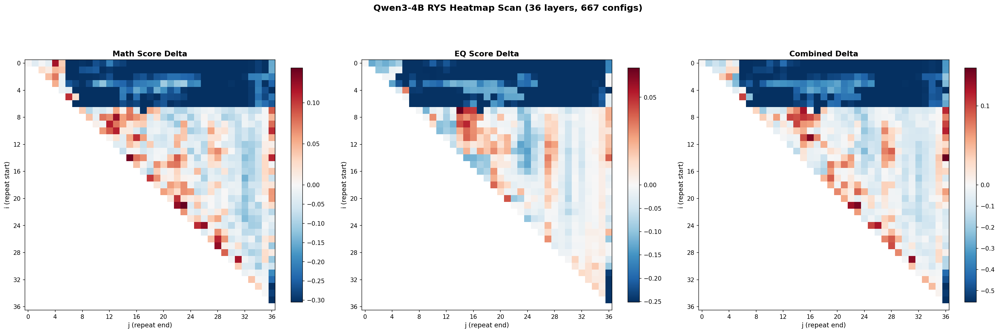
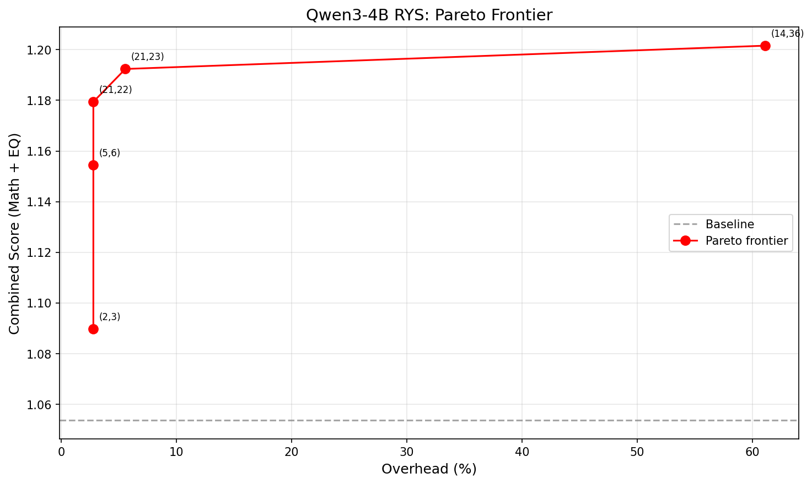

# RYS Layer Duplication Sweep: Qwen3-4B

Exhaustive inference-time layer duplication sweep on Qwen3-4B (36 layers), replicating and extending [David Noel Ng's RYS methodology](https://github.com/dnhkng/RYS) at 4B scale on a single RTX 3090.

**Blog post**: [One Layer, +12%: What 667 Configs Reveal About Small LLM Anatomy](https://austinsnerdythings.com/2026/04/14/rys-layer-duplication-qwen3-4b/)

## Key Findings

- The three-phase **encode / reason / decode** anatomy exists at 4B scale
- **Best efficiency config**: repeat layer 21 once = **+11.9% combined improvement at 2.8% overhead**
- **14/35 single-layer repeats beat baseline** (vs "almost never" at 27B) -- smaller models have more diffuse functional anatomy
- Efficiency curve is sharply concave at 4B: most benefit from the first extra layer, steep diminishing returns after



## Pareto Frontier

| Size | Config (i,j) | Extra layers | Overhead | Combined | Delta |
|------|-------------|-------------|----------|----------|-------|
| S | (2,3) | 1 | 2.8% | 1.090 | +3.4% |
| M | (5,6) | 1 | 2.8% | 1.154 | +9.6% |
| **L** | **(21,22)** | **1** | **2.8%** | **1.179** | **+11.9%** |
| XL | (21,23) | 2 | 5.6% | 1.192 | +13.2% |
| XXL | (14,36) | 22 | 61.1% | 1.202 | +14.0% |



## Setup

- **Model**: [Qwen/Qwen3-4B](https://huggingface.co/Qwen/Qwen3-4B) (BF16, ~8 GB VRAM)
- **Hardware**: RTX 3090, 24 GB VRAM
- **Tooling**: Ng's [RYS repo](https://github.com/dnhkng/RYS) for `build_model_with_layers` and probe datasets
- **Probes**: Math-16 (digit-level partial credit) + EQ-16 (emotion intensity prediction)
- **Decoding**: Greedy, `/no_think`, deterministic

## Repo Contents

| File | Description |
|------|-------------|
| `rys_scan.py` | Single-GPU scanner -- runs all (i,j) configs, resume-friendly |
| `rys_analyze.py` | Heatmap + Pareto analysis, generates plots and summary |
| `rys_experiment_notes.md` | Full experiment log with methodology and observations |
| `results/rys_sweep.json` | Raw results for all 667 configs (4.5 MB, includes per-question details) |
| `results/analysis/` | Generated plots, Pareto JSON, markdown summary |

## Reproducing

```bash
# Clone RYS repo for layer duplicator + probes
git clone https://github.com/dnhkng/RYS

# Download Qwen3-4B
huggingface-cli download Qwen/Qwen3-4B --local-dir Qwen3-4B

# Install deps
pip install torch transformers matplotlib numpy

# Run full sweep (~9 hours on a 3090)
python rys_scan.py

# Generate analysis
python rys_analyze.py
```

The scanner expects `RYS/` and `Qwen3-4B/` as sibling directories. Edit paths at the top of `rys_scan.py` if your layout differs.

## References

- [RYS repo](https://github.com/dnhkng/RYS) -- David Noel Ng
- [LLM Neuroanatomy I](https://dnhkng.github.io/posts/rys/) -- dnhkng
- [LLM Neuroanatomy II](https://dnhkng.github.io/posts/rys-ii/) -- dnhkng
- [Reasoning with Latent Thoughts](https://arxiv.org/abs/2502.17416) -- arxiv
- [LoopFormer](https://arxiv.org/abs/2602.11451) -- arxiv

## License

MIT
